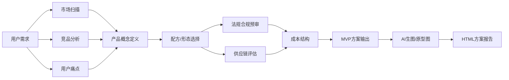

# fmode-product-lab v0.1 | 新品研发 Lab

> **消费品/食品产品创新方案生成器**
> 当用户提出新产品开发需求时，从5个视角综合分析，输出带有AI生成概念图的完整HTML方案。

## 产品知识库目录

### 1. 品类与产品层级（MDM 框架）
```
L1 一级大类  →  营养健康/食品饮料/个人护理
L2 功能赛道 →  复合维生素/蛋白质/益生菌/代餐
L3 渠道监管线 → 跨境HG / 大贸CD / 保健食品HF / 普通食品GF / OTC
L4 产品系列(PV) → 标准包装产品编码
L5 SKU(SAP) → 物料号
```
来源：赫力昂MDM 5级品类架构 + 阿里/抖音平台分类体系

### 2. 法规规则表
| 品类 | 法规类型 | 宣称边界 | 禁用词 |
|------|---------|---------|-------|
| 保健食品(蓝帽) | 《保健食品管理办法》 | 功效需蓝帽批文 | 治疗/治愈/根治 |
| 普通食品 | GB 7718-2011 | 不可宣称功效 | 药用/治疗/预防 |
| 跨境膳食补充 | 按原产国法规 | 可参照US FDA DSHEA | 不可宣称治疗 |
| 特殊膳食 | GB 13432 | 能量/营养成分可标 | 不可暗示医疗 |
| 化妆品 | 《化妆品监管条例》 | 功效需备案 | 医学/医生推荐 |

### 3. 常见营养成分/添加剂规则
| 成分 | 法规限制 | 宣称边界 | 常见载体 |
|------|---------|---------|---------|
| 维生素C | 每日上限1000mg(普通食品200mg/100g) | 抗氧化/增强免疫 | 糖果/饮液/片剂 |
| 益生菌(CFU) | 活菌≥1×10^6 CFU/g(保质期内) | 改善肠道/增强免疫 | 粉剂/胶囊/发酵饮 |
| 胶原蛋白肽 | 每日推荐3-10g | 皮肤弹性/关节健康 | 饮液/果冻 |
| GABA(γ-氨基丁酸) | 每日上限500mg(新资源食品) | 改善睡眠/放松 | 软糖/饮液 |
| 叶黄素酯 | 每日上限20mg | 护眼/抗蓝光 | 软糖/胶囊 |
| 透明质酸钠 | 每日上限200mg | 保湿/关节健康 | 饮液/口服液 |
| 辅酶Q10 | 每日上限300mg(保健食品) | 心脏健康/抗疲劳 | 软胶囊 |
| 白芸豆提取物 | 每日上限3000mg(新食品原料) | 阻断碳水吸收 | 胶囊/压片 |
| 膳食纤维(聚葡萄糖) | 每日25-35g(普通食品可加) | 促进肠道蠕动 | 固体饮料 |
| 乳清蛋白 | 无明确上限 | 增肌/补充蛋白 | 粉剂/RTD |

### 4. 工艺路线对照
| 产品形态 | 工艺 | 设备要求 | 生产周期 | 保质期 |
|---------|------|---------|---------|-------|
| 片剂 | 湿法制粒→压片 | 制粒机+旋转压片机 | 3-5天 | 24月 |
| 软糖 | 浇注/淀粉模 | 浇注线+干燥房 | 5-7天 | 18月 |
| 硬胶囊 | 混合→充填 | 胶囊充填机 | 2-3天 | 36月 |
| 软胶囊 | 化胶→压丸 | 软胶囊机 | 3-5天 | 24月 |
| 口服液 | 配液→灌装→灭菌 | 灌装线+灭菌釜 | 3-4天 | 18月 |
| 固体饮料 | 混合→分装 | 三维混合机+分装机 | 1-2天 | 24月 |
| 果冻(条包) | 化胶→灌装 | 果冻灌装线 | 2-3天 | 12月 |

### 5. 产品创新工作流


## 使用方式

用户输入新品研发需求后，自动执行：

```
步骤1: 解析用户需求（品类/目标人群/价格带/渠道）
步骤2: 5视图分析
  - 市场视图：赛道规模/增长趋势/机会窗口
  - 用户视图：人群画像/痛点/使用场景
  - 供应链视图：原料可得性/生产可行性
  - 工艺视图：形态选择/工艺路线/质量控制
  - 法规视图：合规边界/宣称策略/风险控制
步骤3: 产品概念综合 → 选最优方案
步骤4: 用 fmode-image 生成4张概念图
  - --product 产品设计图（包装/外观）
  - --app 应用界面（品牌展示/详情页）
  - --explode 技术爆炸图（成分/结构分解）
  - --scene 场景插图（用户使用场景）
步骤5: 输出HTLML长页面（方案概述+5视图分析+概念图+路径图）
```

## 调用示例

```bash
# 1. 完成分析并出方案（完整流程）
node scripts/product-lab.mjs \
  --task "设计一款面向25-35岁白领的抗氧化软糖，电商渠道" \
  --output /opt/data/output/product-plan.html

# 2. 从案例02提取方法论参考
# 参考 showroom/case02-productinnovation/ 的九步法框架

# 3. 生成产品概念图
npx fmode-image --product "抗氧化软糖包装设计，主视图+侧视图，品牌名'光感'，白底" ray-gummy-design
```

## 领域规则库（健康快消/食品）

### 法规红线
1. **普通食品不得宣称功效**——只能用"含有XX""有助于"等暗示性表述
2. **保健食品必须有蓝帽**——未经备案不得使用"改善/辅助/增强"等
3. **跨境产品按原产国法规**——但落地广告仍受中国广告法约束
4. **儿童食品(12岁以下)**——禁止使用功能性宣称
5. **新资源食品**——需核实是否在卫健委公告名单内，标注食用限量

### 创新的来源
1. 品类跨界：保健品做软糖、糖果做功能化
2. 形态创新：片剂→饮液→果冻→气雾→贴片
3. 渠道适配：跨境/大贸/内容电商各自最佳形态不同
4. 技术赋能：纳米包裹/缓释/微囊/定向释放
5. 包装即服务：自带勺/盲盒/月定制/组合装

### 定价锚点
| 形态 | 出厂价(元/份) | 零售价(元/份) | 毛利率 |
|------|------------|------------|-------|
| 片剂 | 0.15-0.5 | 0.8-2.0 | 60-70% |
| 软糖 | 0.3-0.8 | 1.5-4.0 | 65-75% |
| 口服液 | 0.8-2.0 | 4.0-10.0 | 60-70% |
| 固体饮料 | 0.5-1.5 | 3.0-8.0 | 65-75% |
| 果冻 | 0.4-1.0 | 2.0-5.0 | 60-70% |

## 依赖
- `fmode-image`（npm 包，v0.2.0+）
- `node >= 18`
- Python3（用于可选PDF转图片，非必需）

## 关联技能
- `skill-image` → 图片生成
- `fmode-cdn-deploy` → 部署方案到CDN
- `task-dispatch` → 委派CC执行大方案